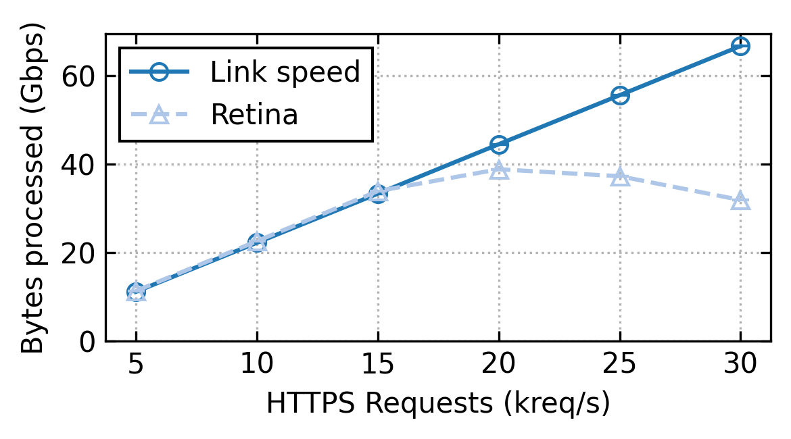

# Retina experiments

This repository contains the scripts to run an experiment of the [Retina](https://github.com/stanford-esrg/retina) paper. 

For most experiments we used a TAP on the Stanford traffic. For the Figure 6 experiment we used 2 machines in a client/server scenario, and a third machine acting as a TAP between those machines.

The experiment manager is [NPF](https://github.com/tbarbette/npf), allowing to easily deploy the scripts over a cluster, and re-run experiments for multiple points and variables. In this experiment we will, as in the paper, augment the offered HTTP load and see how competing solutions perform.

Before running the experiments, you need to prepare your testbed according to the following guidelines.

## Physical testbed
For the results in the paper, we used our own 100G machines. We propose to use CloudLab, a publicly available machine provider for research purpose.
In any cases you need Mellanox NICs (ConnectX 4-7 or BlueField 1-2), hardware support for other NICs is untested.

### CloudLab
The profile used for the machines is available at [Retina-TAP](https://www.cloudlab.us/p/NetSched/retina-tap) . 

This profile will build a ring of 3 machines. Both client and server use their second interface to mirror packets to the dut running retina. The machine uses Ubuntu 20.04, we recommend doing the same.

Create an account on [CloudLab](https://www.cloudlab.us/) then follow the link above and click on "instanciate".
The profile has a parameter to set the machine type. You should select d6515 machines to have a 100G experiment. If none are available, then in general the c6525-25g are available. However it will run at 25G.
No need to give a name to the experiment then click on Finish. The profile will automatically launch the bootstrap.sh script to install everything on all machines.  After a dozen minutes, you will get the SSH command to jump to the server.

#### Verify the cloudlab image works
	
	cd /mydata/retina-expe/
	tail -f /local/logs/startup.log

Verify the last line is "Boostrap finished!", if not the script may still be running. It takes about 15 minutes install all dependencies and continue despite the node being marked as "ready".

### Alternative : your own testbed
You need 3 x86_64 machines with dual-port 100G Mellanox NICs (CX4 to CX7 or BF1-2). Other 100G NICs should work, but they're untested. Machine 1 and 2 should have their first interface connected together. Their second interface connected to port 0 and 1 of the third machine.

We recommand using Ubuntu 20.04 as this is what we used for all experiments.

## Software

We provide a script to automatically build dependencies, configure hugepages, ... It works on ClouldLab, and should work on your Ubuntu testbed too.

### Automatic
**This is already run on the cloudlab profile, you have nothing to do.**
Run ./bootstrap.sh on all machines to install all dependencies at once. This will only work with Ubuntu (preferably 20.04).

### Manual

#### Network Performance Framework (NPF) Tool

You can install npf via the following command:

    python3 -m pip install --user npf

Do not forget to add export PATH=$PATH:~/.local/bin to ~/.bashrc or ~/.zshrc. Otherwise, you cannot run npf-compare and npf-run commands.

NPF will look for cluster/ and repo/ in your current working/testie directory. We have included the required repo for our experiments and a sample cluster template, available at experiment/. To setup your cluster, please check the guidelines for our previous paper. Additionally, you can check the NPF documentation at https://npf.readthedocs.io/.

#### Mellanox OFED, DPDK, Rust and Retina
Follow https://github.com/stanford-esrg/retina/blob/main/INSTALL.md

#### Suricata
Install Suricata if you want to reproduce the comparison test against Suricata. You need the "master" version, as the DPDK support is in no release yet.

```
sudo apt-get -y install python3 python3-pip build-essential meson pkg-config libnuma-dev python3-pyelftools libpcap-dev libclang-dev libyaml-dev  libpcre3 libpcre3-dbg libpcre3-dev libpcap-dev   \
                libnet1-dev libyaml-0-2 libyaml-dev pkg-config zlib1g zlib1g-dev \
                libcap-ng-dev libcap-ng0 make libmagic-dev         \
                libnss3-dev libgeoip-dev liblua5.1-dev libhiredis-dev libevent-dev libjansson-dev liblz4-dev libpcre2-dev
cargo install --force cbindgen
git clone https://github.com/OISF/suricata.git
pushd suricata
#Build libhtp
git clone https://github.com/OISF/libhtp
pushd libhtp
./autogen.sh && ./configure && make && sudo make install
popd
./autogen.sh
./configure --enable-dpdk
make
sudo make install
```

## Running the experiment
Our experiments uses NPF, a tool to manage experiments, run the tests over a cluster and collect results.

### Configuring NPF
NPF needs passwordless sudo access through SSH to all machines. This is already provided if using the CloudLab image.

### Details about NPF
NPF uses a test description files that gives variables, scripts, setup phase, where to run what, ... It is in this repository "http.npf".

At first run, NPF itself will build some dependencies by itself, such as FastClick to compute baseline speeds and WRK to generate HTTP load.
Then NPF will run some init scripts on all machines. Installing NGINX on "server", configuring  IPs, ...

Then for values of given variables, NPF will run scripts on all machines. In the first experiment for intance we re-run the same test but with 25 generation rates. Each test is run 3 times. And this is done for all "series" (baseline, Retina, Suricata, ... think of it as lines in your line graph).
If you re-launch NPF, it will not re-run tests for variables already tried. For instance, if you try a first run with CPU=1, then re-try CPU=[1-8], only the tests for CPU=2 to 8 will run. The results from 1 will be taken in cache. If you want to force re-run the test, use `--force-retest`.

Then some cleanup python scripts are done after each runs, to parse results from logs and export it in the NPF format.

After all tests, NPF will automatically produce some graph. You can add --output out.csv to generate some CSVs.

### Running NPF

Here is each argument of the command line explained line by line:
```
	npf-compare 
	 "local+fastclick,SAMPLE=pkt_count:Link speed" #The first serie to try : a baseline that only counts packets
	  local+retina:Retina #The second serie : Retina itself
	  --test http.npf #The test script
	  --cluster #The NPF scripts define "roles" such as client and servers. Here you tell which machine will take which roles.
			client=node-0-ctrl,nfs=0 #The "client" will be the machine named node-0-ctrl. It is not using NFS so we have to copy everything to the machine
			server=node-1-ctrl,nfs=0
			dut=node-2-ctrl,nfs=0
	--show-full  #Show stdout and stderr in live, will create a lot of outputs but will tell you what's happening
	--show-cmd  #Show the command launched and where
	--variables #Override a few variables that will define parameters of the experiment
		 "CPU=1" #Number of CPU to use
		 "SAMPLE=log_tls" #The test app to run
		 "DPDK_PATH=$DPDK_PATH" #Env variables will not pass through ssh and sudo. We have to pass them explicitely
	--graph-filename ssl.pdf # basename for the generated graphs
	--tags ssl tls rate high #Tags according to the experiment, see http.npf
```

**Warning: if using the CloudLab c6525-25g nodes, add the ",nic=1+2" parameter to each nodes. Eg `client=node-0-ctrl,nfs=0,nic=1+2`. This is because NPF detects the NICs on the cluster machines, but those nodes use 25G mellanox NICs for both experiment and control, therefore NPF's interface 0 is actually the control NIC. Failure to do so will break the node connectivity. The only solution will therefore be to powercycle the node throught the CloudLab interface.**

The final command to run is therefore:
```
	cd /mydata/retina-expe/
	source /local/env
	npf-compare "local+fastclick,SAMPLE=pkt_count:Link speed" local+retina:Retina --test http.npf --cluster client=node-0-ctrl,nfs=0 server=node-1-ctrl,nfs=0 dut=node-2-ctrl,nfs=0 --show-full --show-cmd --variables "CPU=1" "SAMPLE={log_tls}" "DPDK_PATH=$DPDK_PATH" "GEN_RATE=[5000-30000#5000]" --graph-filename ssl.pdf --graph-size 6 3 --tags ssl tls rate
```

This will produce a few PDF graphs, the ssl-avg_good_bps.pdf shoud look like the image below. Currently, only the baseline and Retina are tested. We're adding Suricata, stay tuned!




